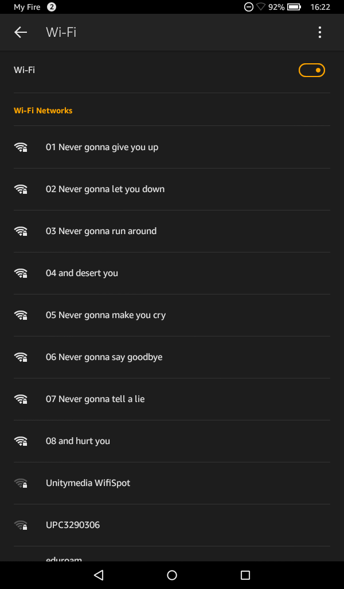

# ESP32 802.11 Freedom Output


## Introduction
Even though Espressif open sourced their [IoT Development Framework](https://github.com/espressif/esp-idf), the underlying [esp32-wifi-lib](https://github.com/espressif/esp32-wifi-lib) remains closed source and sparsely documented. Since I still wanted to be able to send arbitrary IEEE 802.11 data frames, I took a look at the `ieee80211_freedom_output` function in `ieee80211_output.o` in `libnet80211.a`. By reverse engineering the assembly code I was able to find a workaround / hack that makes it possible to use `ieee80211_freedom_output` and force the ESP32 to send data or management frames with custom data.

This functionality can be useful in various ways, e.g. for mesh networking, [unidirectional long-distance communication](https://www.youtube.com/watch?v=tBfa4yk5TdU) or low-overhead data transmission. It can, however, be abused for spamming large numbers of invalid SSIDs, jamming WiFi networks or sending deauthentication frames in order to sniff SSIDs of hidden wireless networks. Please be advised that such usage is morally doubtful at best and illegal at worst. Use this at your own risk.

## Project Description
In order to demonstrate the freedom output functionality, this software broadcasts the infamous lines from Rick Astley's `Never gonna give you up`. This is achieved by manually assembling IEEE 802.11 beacon frames in `main.c` and broadcasting them via the hidden `ieee80211_freedom_output` function in espressif's WiFi stack.

If you want to use raw packet sending functionality in your own project, just copy the `components/free80211` component. The only function it exposes is the following:

```C
// buffer: Raw IEEE 802.11 packet to send, will be sent as-is, apart from bytes 24 - 31 which will be set to 0x00 in case buffer[0] is 0x80.
// len: Length of IEEE 802.11 packet. Must be larger than 23 and smaller than or equal 0x578.
int8_t free80211_send(uint8_t *buffer, uint16_t len);
```

### Compile / Flash
This project uses the [Espressif IoT Development Framework](https://github.com/espressif/esp-idf). With the ESP-IDF installed, execute
```
make menuconfig
```
and configure the SDK to use your preferred settings (baudrate, python2 executable, serial flasher port, …) and proceed to compile and flash this project using
```
make flash
```

## Project License: MIT
```
Permission is hereby granted, free of charge, to any person obtaining a copy of this software and associated documentation files (the "Software"), to deal in the Software without restriction, including without limitation the rights to use, copy, modify, merge, publish, distribute, sublicense, and/or sell copies of the Software, and to permit persons to whom the Software is furnished to do so, subject to the following conditions:

The above copyright notice and this permission notice shall be included in all copies or substantial portions of the Software.

THE SOFTWARE IS PROVIDED "AS IS", WITHOUT WARRANTY OF ANY KIND, EXPRESS OR IMPLIED, INCLUDING BUT NOT LIMITED TO THE WARRANTIES OF MERCHANTABILITY, FITNESS FOR A PARTICULAR PURPOSE AND NONINFRINGEMENT. IN NO EVENT SHALL THE AUTHORS OR COPYRIGHT HOLDERS BE LIABLE FOR ANY CLAIM, DAMAGES OR OTHER LIABILITY, WHETHER IN AN ACTION OF CONTRACT, TORT OR OTHERWISE, ARISING FROM, OUT OF OR IN CONNECTION WITH THE SOFTWARE OR THE USE OR OTHER DEALINGS IN THE SOFTWARE.
```
